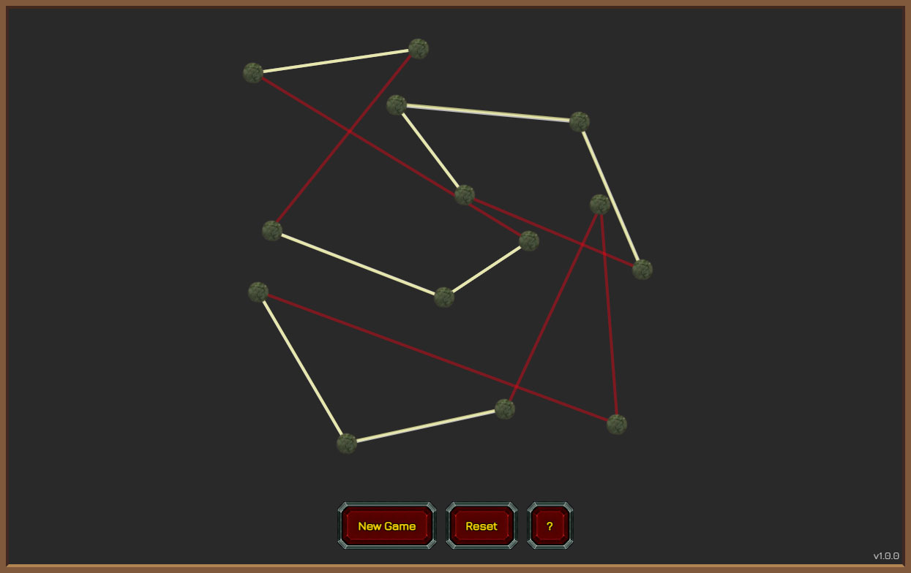

# Toccatian Protolock
Toccatian Protolock is a puzzle game from World of Warcraft patch 9.2.

Remade in pure JavaScript.

The goal of this game is to untangle all lines by switching places of their dots.

Live version can be found on [itch.io](https://ginpachi987.itch.io/toccatian-protolock) and [yoro.dev](https://games.yoro.dev/toccatian/).

## Commands
### Installation
    npm install
    npm run dev

### Build
    npm run build